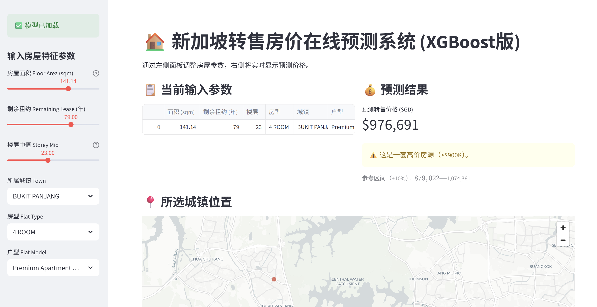
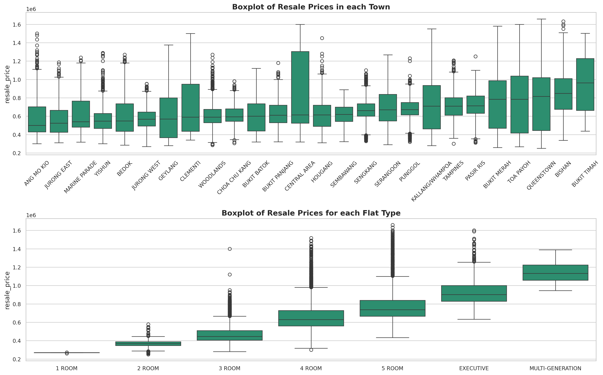
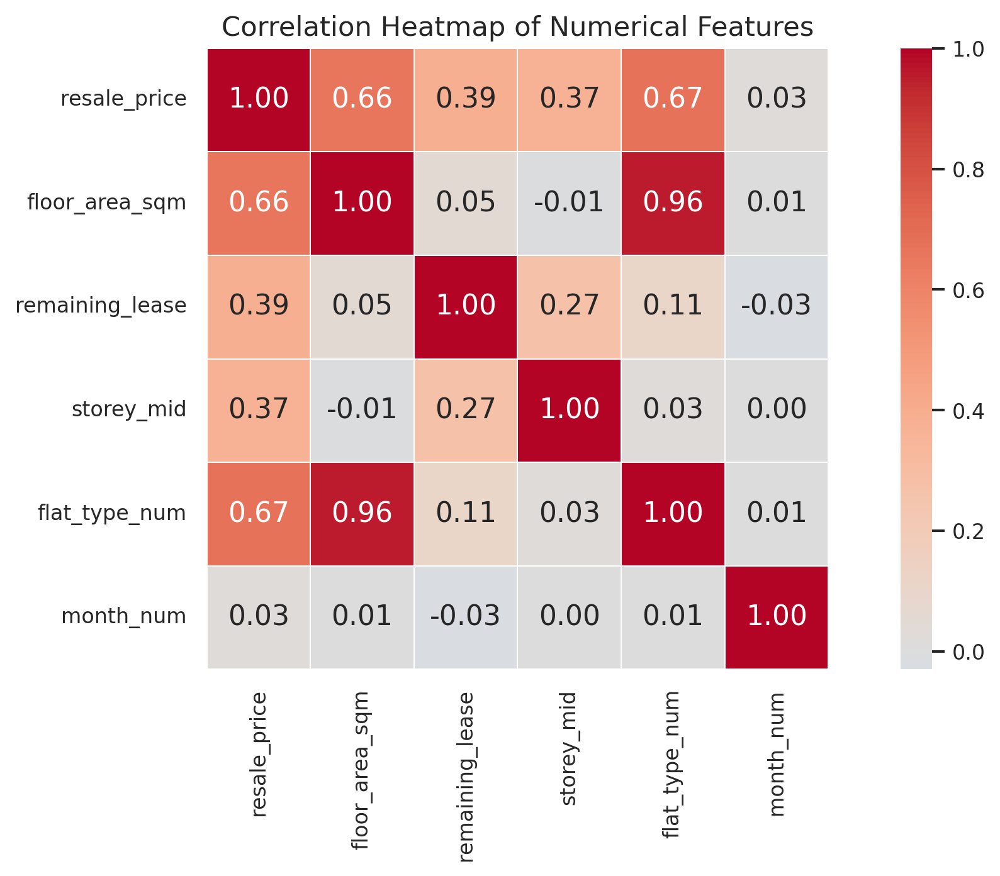
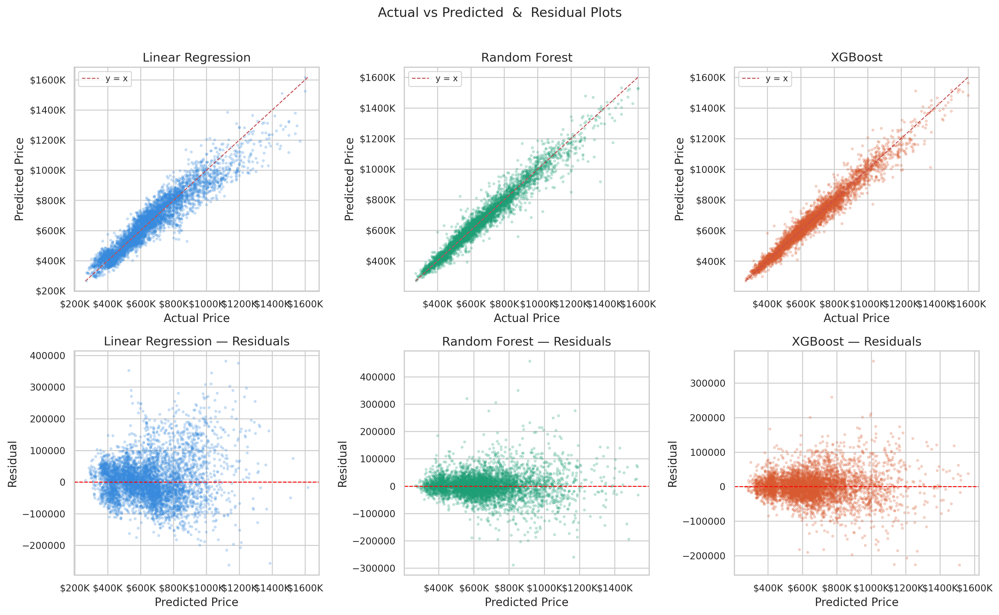
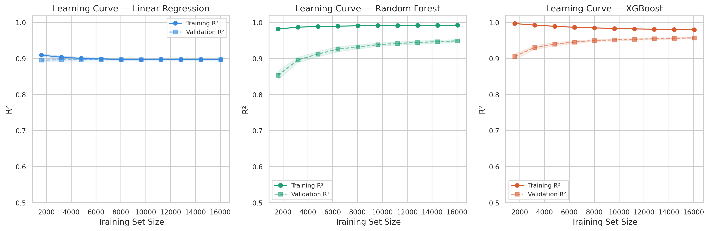
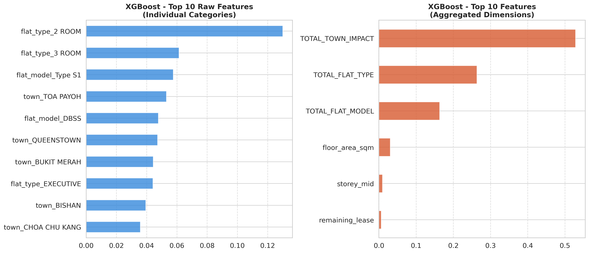

# 2025 年新加坡 HDB 转售房价分析与预测

**Singapore HDB Resale Price Analysis & Prediction (2025) — EDA, Model Comparison and Streamlit App**

基于 2025 年新加坡 HDB（组屋）转售成交数据，完成**数据清洗 → 探索分析 → 线性回归 / 随机森林 / XGBoost 三模型对比 → 在线预测网页**的完整流程。最终模型（XGBoost）测试集 **R² = 0.9627，MAPE = 4.19%**。

  

<!-- 如果已部署在线演示，取消下一行注释并填入链接
**在线演示**：【Streamlit 链接】
-->



---

## 1. 项目背景与问题

HDB 转售价格受面积、房型、地段、楼层、剩余租约等多种因素影响。本项目希望回答：

1. 哪些因素对转售价格影响最大？
2. 能否建立一个可靠的模型，根据房屋特征预测转售价格？
3. 能否把模型做成可交互的工具，让普通用户直接使用？

## 2. 数据

| 项目 | 说明 |
|---|---|
| 数据来源 |  data.gov.sg 的 HDB Resale flat prices 数据集 |
| 原始文件名 | `Resale flat prices based on registration date from Jan-2017 onwards.csv` |
| 使用范围 | 截取 2025 年（1–12 月）成交记录，共 25,086 行；删除 13 行重复记录后为 **25,073 行** |
| 缺失值 | 无 |
| 目标变量 | `resale_price`（转售价格，SGD） |

> 本仓库**不包含原始数据**，获取与运行方式见第 9 节。

## 3. 分析流程

```
数据清洗 → 特征可视化分析 → 划分训练/测试集（8:2）→ 特征工程
        → 5 折交叉验证 + GridSearchCV 调参 → 测试集评估 → 保存 Pipeline → Streamlit 预测网页
```

| 步骤 | 做法 |
|---|---|
| 清洗 | 删除完全重复行；箱线图检查价格与面积的异常值，确认为真实高价/大面积房源后**保留** |
| 特征处理 | `storey_range` 取中值生成 `storey_mid`；`remaining_lease` 转为数值（年）；`town` 等类别变量独热编码；数值特征标准化 |
| 共线性处理 | `floor_area_sqm` 与 `flat_type_num` 的 VIF 均 > 10（相关系数 0.96），线性回归中剔除 `flat_type_num`；树模型保留 `flat_type` |
| 剔除特征 | `month_num`（与价格相关系数仅 0.03）；`block`、`street_name`（类别过多且与 `town` 信息重叠） |
| 目标变量 | 价格右偏，线性回归使用对数价格建模 |
| 模型 | 线性回归（基准）、随机森林、XGBoost；均封装在 sklearn `Pipeline` 中，避免数据泄露 |
| 调参 | 5 折交叉验证（`shuffle=True`，随机种子 42）；随机森林 27 组参数、XGBoost 108 组参数网格搜索 |
| 评估 | R²、Adj R²、RMSE、MAE、MAPE，残差图，学习曲线 |

**最终进入模型的特征**：`floor_area_sqm`、`remaining_lease`、`storey_mid`、`flat_type`、`town`、`flat_model`（线性回归不含 `flat_type`）

**工具**：Python（pandas、numpy、scikit-learn、XGBoost、statsmodels、seaborn、matplotlib）、Streamlit、joblib

## 4. 数据探索中的发现

- 价格明显右偏，主要集中在 40–80 万新元；取对数后接近正态。
- 房源集中在中低楼层、中小户型；Tampines 和 Sengkang 成交最多，4 房式是主流房型。
- 与价格相关性：房型编号（0.67）、面积（0.66）较强，剩余租约（0.39）、楼层（0.37）次之。
- 价格随房型增大而上涨；Bukit Timah 价格中位数较高，Queenstown 价格波动最大。





## 5. 模型结果

| 模型 | CV R² | 测试集 R² | RMSE (SGD) | MAE (SGD) | MAPE |
|---|---|---|---|---|---|
| 线性回归 | 0.8967 ± 0.0018 | 0.8923 | 67,252 | 49,773 | 7.56% |
| 随机森林 | 0.9493 | 0.9550 | 43,457 | 29,197 | 4.40% |
| **XGBoost** | **0.9573** | **0.9627** | **39,593** | **27,714** | **4.19%** |

- XGBoost 各项指标最优，对单套房屋的估价平均偏差约 **2.77 万新元**。
- XGBoost 最优参数：`n_estimators=300, learning_rate=0.1, max_depth=7, subsample=0.8, colsample_bytree=0.8`。
- 注：线性回归的 CV R² 是在对数价格上计算的，与树模型的 CV R² 不完全可比；测试集指标均为原价格尺度。





## 6. 特征重要性

XGBoost 的特征重要性按维度汇总后：**城镇约 52%，房型次之，Flat Model 约 16%**，面积、楼层、剩余租约单项占比较小。

> 面积单项重要性低，并不代表面积不重要：面积与房型高度相关（r = 0.96），其信息大部分已被 `flat_type` 吸收。



## 7. 数据观察（供参考）

以下是基于本数据集的观察，不构成购房或投资建议：

- **房型**：价格随房型增大而上升，4 房、5 房是刚需家庭常见选择。
- **地段**：城镇对预测影响最大；Bukit Timah、Queenstown、Bishan 等核心区价格中位数较高；Yishun、Woodlands、Bedok 等区域价格相对较低。
- **稀缺户型**：DBSS、Type S1 等稀缺 Flat Model 在模型中影响显著。
- **性价比思路**：非热门区域 + 中低楼层，可用相近预算换取更大面积。

注意：特征重要性反映的是对预测的贡献，不等同于因果意义上的“溢价”。

## 8. 在线预测网页（Streamlit）

`app.py` 加载训练好的 Pipeline，用户在侧边栏输入房屋参数，页面实时显示预测价格。

| 输入 | 说明 |
|---|---|
| 房屋面积 | 31–195 平方米 |
| 剩余租约 | 40–95.5 年 |
| 楼层中值 | 2–50（每 3 层一档） |
| 城镇 / 房型 / 户型 | 下拉选择 |

功能：实时预测价格、按价格区间给出档次提示（>$900K 高价、<$400K 经济型）、显示 ±10% 的参考区间、地图展示所选城镇位置。

> 说明：±10% 是粗略的参考范围，**不是统计意义上的置信区间**。模型的平均误差（MAPE）约为 4.19%。

## 9. 仓库结构与运行方法

```
├── README.md
├── ECA.ipynb                       # 数据分析与建模代码
├── app.py                           # Streamlit 预测网页
├── xgboost_housing_pipeline.pkl     # 训练好的模型
├── requirements.txt                 # 依赖
└── images/                          # 输出图表
```

**运行步骤**

1. 克隆仓库并安装依赖：
   ```bash
   git clone https://github.com/w15034923897-cyber/sg-hdb-resale-price-prediction.git
   cd sg-hdb-resale-price-prediction
   pip install -r requirements.txt
   ```
2. 准备数据：因授权原因，原始数据未上传。请从数据来源下载，保存为
   `Resale flat prices based on registration date from Jan-2017 onwards.csv`，与 `code.ipynb` 放在同一目录。
3. 运行 `code.ipynb` 复现分析与建模。Notebook 中已保留运行结果，不运行也可直接查看。
4. 启动预测网页（需要 `xgboost_housing_pipeline.pkl` 与 `app.py` 在同一目录）：
   ```bash
   streamlit run app.py
   ```

> 模型文件由 scikit-learn 与 XGBoost 序列化生成。加载时请使用相近版本的库，否则可能报错。

## 10. 局限与改进方向

- **数据时间跨度短**：仅 2025 年单年度数据，缺少市场周期信息，存在时效性风险。
- **地理信息未充分利用**：`block`、`street_name` 未纳入，无法捕捉同一城镇内的价格差异。
- **缺少外部特征**：如距 MRT 距离、学校、商场等；也未考虑利率、政策等宏观因素。
- **可解释性**：XGBoost 预测效果好，但可解释性有限，后续可结合 SHAP 解释单个预测。
- **改进方向**：引入地理编码和外部特征；扩展到多年份数据并加入时间特征。

## 11. 说明

本项目为课程项目，预测结果仅供学习交流，不代表官方成交价，也不构成任何投资建议。

**联系方式**：wangran002@suss.edu.sg｜ 【LinkedIn / 个人主页】
